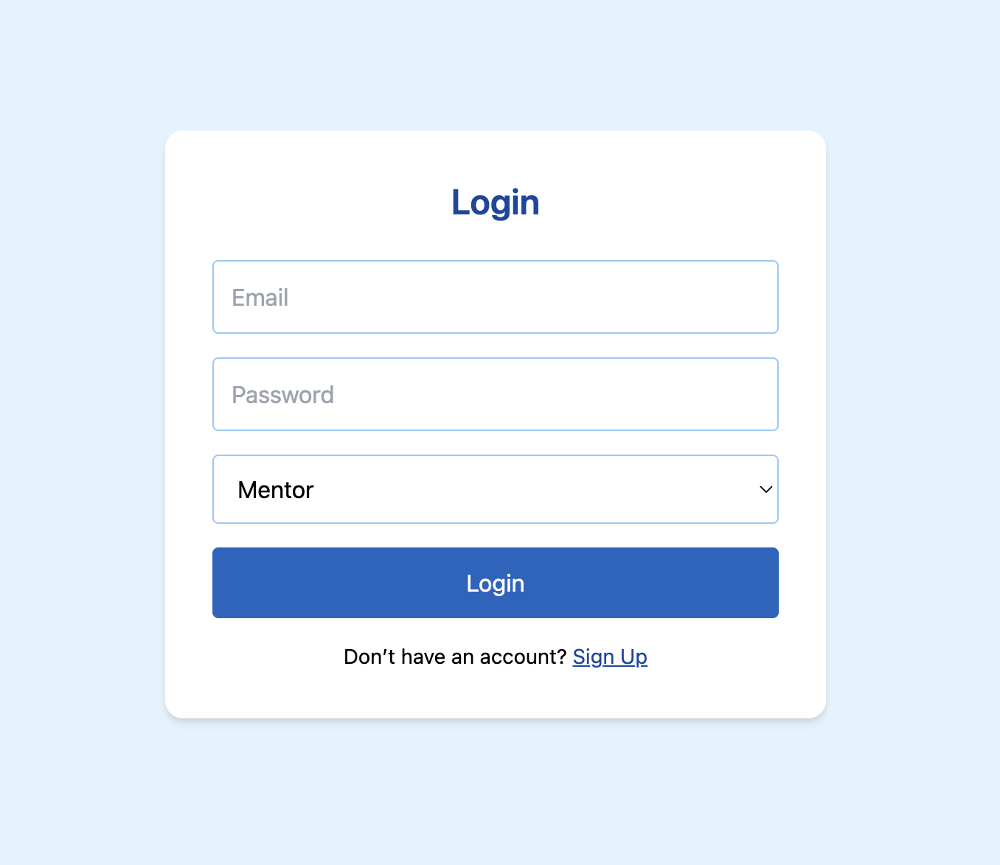
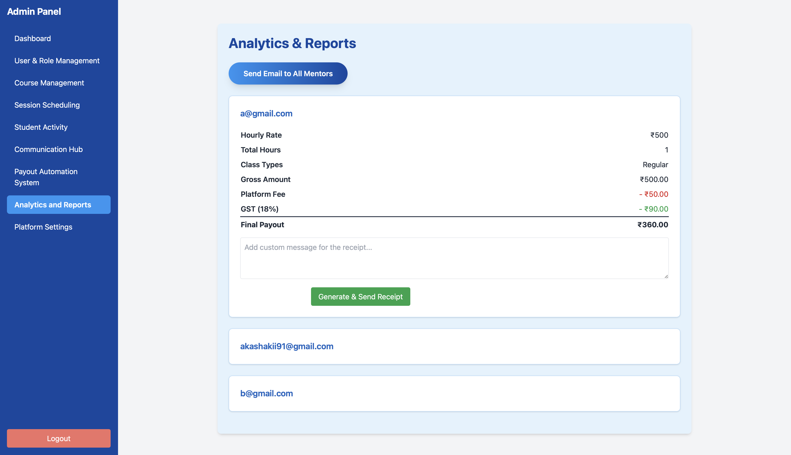
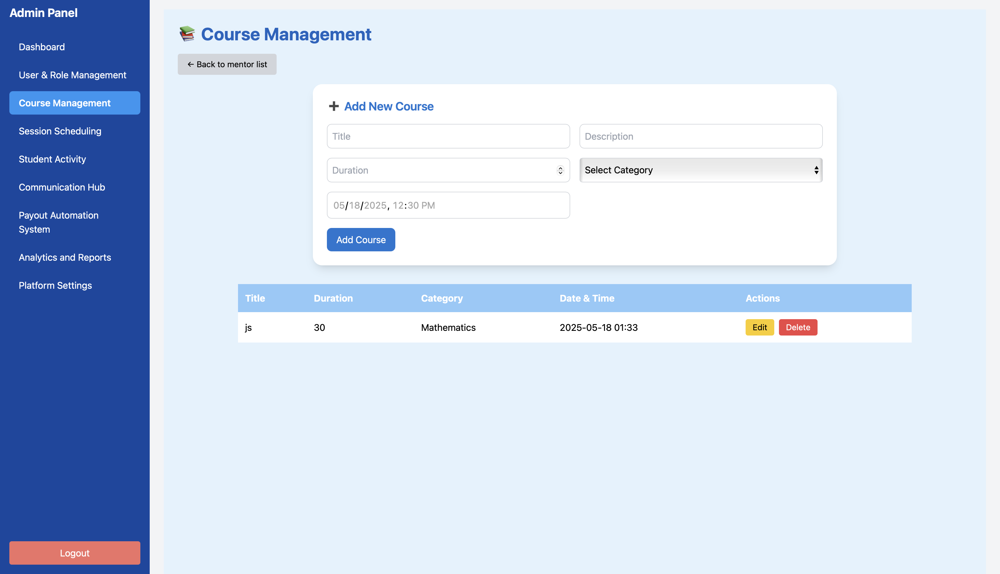
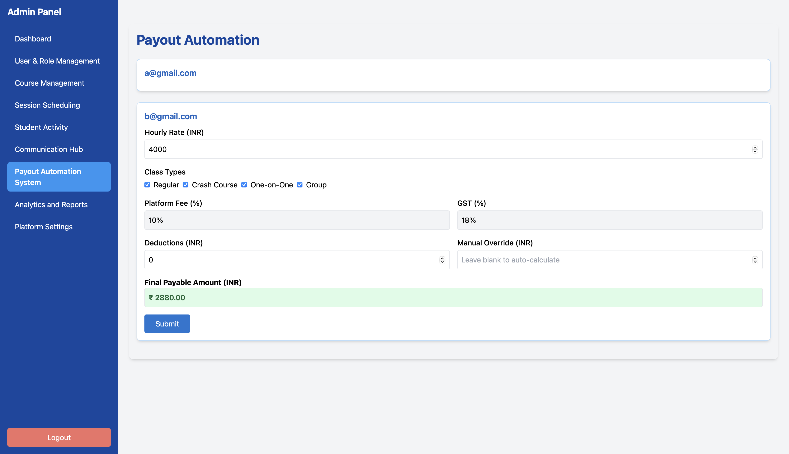
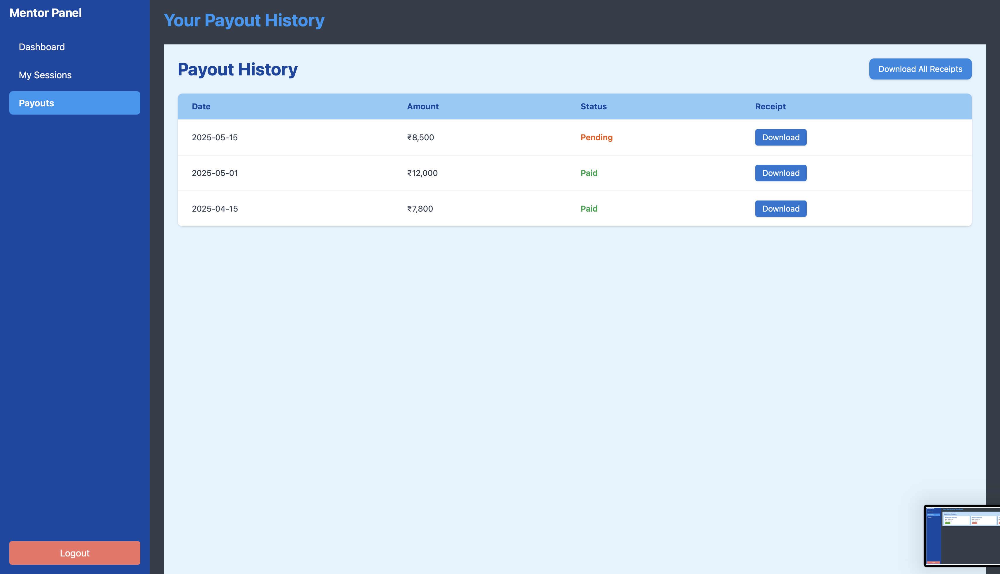
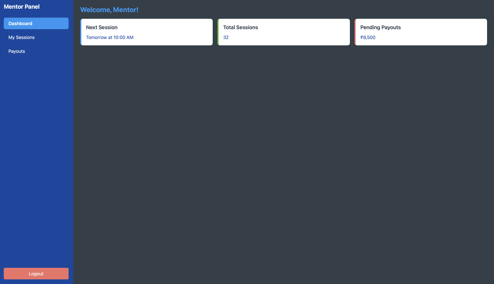

# EdTechMentors
A secure, flexible, and auditable payout automation platform for EdTech companies to efficiently manage payments to mentors and educators. It handles multiple session types, varying rates, tax rules, and communication across time zones—ensuring transparency, accuracy, and scalability.


# EdTechMentors 🧑‍🏫💼

**EdTechMentors** is a full-stack web application designed to simplify and automate session tracking, mentor payouts, and reporting for EdTech platforms. It features role-based access for **Admins** and **Mentors**, allowing efficient oversight and seamless operations.

---

## 🚀 Live Demo

> 🟢 Deployed via [Vercel](https://vercel.com/)  
> Ensure that deployment is done from the `payout-system/` folder inside the root project.

---

## 🧭 Features Overview

### 🔐 Authentication
- **Mentors:** Cannot self-register. Accounts are created by admins.
- **Admins:** Have full access to the system to manage users, sessions, payouts, and reports.

### 👨‍🏫 Mentor Dashboard
- Login securely via Firebase.
- View upcoming session schedule.
- Track earnings and view payout history.
- Download structured receipts with earnings breakdowns.

### 👨‍💼 Admin Dashboard
- Create mentor accounts via Firestore.
- Set class types and hourly rates.
- Auto-calculate payouts (includes GST, platform fees, and deductions).
- Generate and email receipts to mentors.
- View historical payouts and full analytics/reporting section.

---

## Deployed App
Frontend: [https://ed-tech-mentors-hmxysa16v-akash-collabs-projects.vercel.app/login](https://ed-tech-mentors-hmxysa16v-akash-collabs-projects.vercel.app/login)  
Backend: Firebase (Firestore, Auth, Functions)  
Database: [https://console.firebase.google.com/](https://console.firebase.google.com/)

---

## 📂 Project Structure

```bash
edtechMentors/
├── payout-system/             # React frontend application
│   ├── public/                # Static assets
│   ├── src/
│   │   ├── components/        # Reusable UI components
│   │   ├── pages/             # Route-based page components
│   │   ├── firebase/          # Firebase config & services
│   │   ├── App.js             # Main app file with routing
│   │   └── index.js
│   ├── .env                   # Environment variables (not pushed to GitHub)
│   └── package.json
├── README.md

Features

🔐 Role-Based Authentication
	•	Firebase Auth integration
	•	Mentors cannot self-register; only Admins can create their accounts
	•	Secure login for Admins and Mentors

🧑‍🏫 Mentor Dashboard
	•	View upcoming sessions
	•	Track earnings and view payout history
	•	Download PDF receipts with detailed breakdowns

🧑‍💼 Admin Dashboard
	•	Create mentor accounts
	•	Set hourly rates per mentor
	•	Define session types and calculate payouts
	•	View all payments in an analytics dashboard
	•	Generate and email structured receipts with tax, fee, and deduction info
	•	Supports manual override with audit logging

⸻

Design Decisions or Assumptions
	•	Mentors only access their own data; Admins manage the full system
	•	Data separation and protection ensured using Firestore rules
	•	All payouts are auto-calculated, but admin can manually edit values with reason logging
	•	Receipts are dynamically generated and sent via Firebase Cloud Functions

⸻

Installation & Getting Started

Clone the repository
git clone https://github.com/akash-collab/edtechMentors.git
cd edtechMentors/payout-system

Install dependencies
npm install

Run the project locally
npm run dev

Build for production
npm run build

Firebase Setup (Required)
	1.	Go to Firebase Console
	2.	Create a new project
	3.	Enable:
	•	Email/Password Authentication
	•	Firestore Database
	•	Cloud Functions (for sending emails)
	4.	Add Firebase config to .env file in payout-system/

        VITE_API_KEY=your_api_key
        VITE_AUTH_DOMAIN=your_project.firebaseapp.com
        VITE_PROJECT_ID=your_project_id
        VITE_STORAGE_BUCKET=your_project.appspot.com
        VITE_MESSAGING_SENDER_ID=your_sender_id
        VITE_APP_ID=your_app_id     

Firebase Authentication
	•	Firebase Auth used to log in mentors and admins
	•	Account creation for mentors is handled by admins via Firestore

⸻

Usage

Admin Dashboard
	•	Login as Admin
	•	View list of mentors
	•	Add new mentors and assign rates/class types
	•	Review and override payouts with platform fees, tax, and GST
	•	Generate and email PDF receipts
	•	View full payment analytics and logs

Mentor Dashboard
	•	Login with provided credentials
	•	View upcoming sessions
	•	View and download payout history
	•	Access earnings summary and receipt PDFs

⸻

Screenshots










Credentials (Demo)
	•	Mentor Email: akashmentor@test.com
	•	Password: test1234
	•	(Note: actual registration is admin-controlled)

⸻

Technology Stack
	•	Frontend: React.js, Tailwind CSS, React Router
	•	Authentication: Firebase Auth
	•	Database: Firestore
	•	Serverless Functions: Firebase Cloud Functions
	•	PDF Generation: jsPDF
	•	Deployment: Vercel

⸻

Deployment (Vercel)
	1.	Connect your GitHub repo on Vercel
	2.	Set the project root to payout-system/
	3.	Set build command: npm run build
	4.	Set output directory: build
	5.	Add all .env values in Vercel Environment Settings

✅ Do not deploy from root folder — always deploy from payout-system/.

⸻

Future Enhancements
	•	Mentor session performance insights
	•	Notification center for admin and mentors
	•	Receipt branding and logo customization
	•	CSV/Excel export of payouts and session logs

⸻

Author

Developed by Akash
For collaboration or deployment help, contact via GitHub.

⸻

License

For internal EdTech use only. Licensing TBD upon open source release.

⸻
